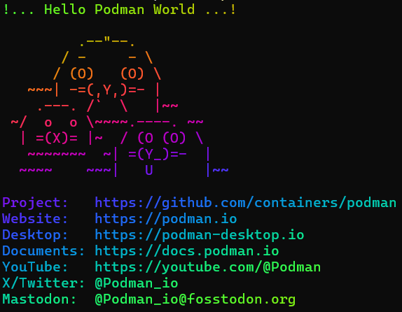
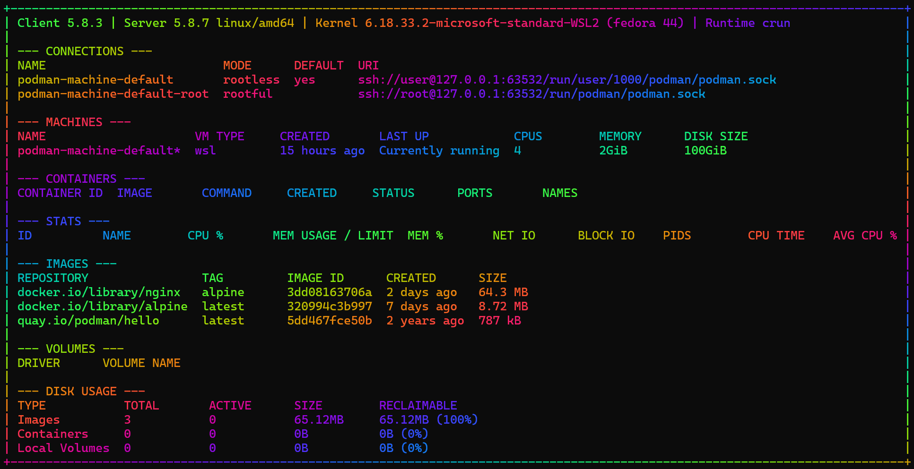

# podman

Personal notes and experiments for learning [Podman](https://podman.io/) and containers, plus
some PowerShell helper functions for everyday Podman use on Windows.

[`PLAN.md`](PLAN.md) is the step-by-step plan for learning Podman, with labs and a progress tracker.
It was prepared with AI; see [How AI is used in this project](#how-ai-is-used-in-this-project).

## Requirements

- [Podman](https://podman.io/docs/installation) with a Podman machine (`podman machine init`)
- [lolcatjs](https://www.npmjs.com/package/lolcatjs) for the rainbow output: `npm install -g lolcatjs`

## PowerShell helpers

[`PodmanHelpers.ps1`](PodmanHelpers.ps1) defines these functions, which can also be seen by running `pod-help` on the command line.

**--- MACHINE ---**

| Function | What it does |
|---|---|
| `pod-sys-start` | Start the Podman machine |
| `pod-sys-stop` | Stop the Podman machine |

**--- RUN ---**

| Function | What it does |
|---|---|
| `pod-run <image> [command...]` | Run an image once, optionally with a command, and remove the container afterwards (`podman run --rm`) |
| `pod-start <name> [image]` | Start a container named `<name>` in the background, detached, then list containers (`podman run -d`, `podman ps -a`). Without an image, start the existing container named `<name>` (`podman start`) |
| `pod-start-nginx <name>` | Start an nginx Alpine container named `<name>` in the background (`pod-start <name> docker.io/library/nginx:alpine`) |
| `pod-start-alp <name>` | Start an Alpine container named `<name>` in the background, kept running with `sleep infinity`, then list containers (`podman run -d ... docker.io/library/alpine sleep infinity`, `podman ps -a`) |
| `pod-stop <name>` | Stop a named container without removing it, then list containers (`podman stop`, `podman ps -a`) |
| `pod-rm-con <name>` | Remove a named container, but not if running, then list containers (`podman rm`, `podman ps -a`) |
| `pod-rm-img <name>` | Remove a named image, but not if in use, then list images (`podman rmi`, `podman images`) |
| `pod-proc <name>` | Show a named container's running processes (`podman top`) |
| `pod-show <name>` | Show a named container's full details (`podman inspect`) |
| `pod-log <name>` | Follow a named container's logs (`podman logs -f`) |
| `pod-open <image> [shell]` | Run an image interactively with a shell, defaulting to `sh`, and remove the container afterwards (`podman run -it --rm`) |
| `pod-exec <name> <command> [args...]` | Run a command in a running container's terminal (`podman exec -it`) |
| `pod-edit <name>` | Open a `sh` shell in a running container (`pod-exec <name> sh`) |
| `pod-alp` | Open the Alpine image's `sh` shell (`pod-open docker.io/library/alpine sh`) |
| `pod-nginx` | Open the nginx Alpine image's `sh` shell (`pod-open docker.io/library/nginx:alpine sh`) |
| `pod-test` | Check Podman works by running `quay.io/podman/hello` |
| `pod-test-alp` | Show the Alpine image's release with `cat /etc/os-release` |
| `pod-test-nginx` | Show the nginx Alpine image's release with `cat /etc/os-release` |

**--- IMAGES ---**

| Function | What it does |
|---|---|
| `pod-digest` | List images with their repository tags and digests (`podman images --digests`) |
| `pod-hist <image>` | Show an image's layer history (`podman history <image>`) |

**--- INFO ---**

| Function | What it does |
|---|---|
| `pod-ls` | Podman dashboard: client/server versions, connections, machines, containers, container stats, images, volumes and disk usage, in a box |
| `pod-alias [filter]` | List podman's registered short-name aliases (from `registries.conf` and its drop-ins, plus `short-name-aliases.conf`), optionally only those whose name contains the filter |
| `pod-help` | List every pod-* helper with a one-line description, grouped by what it does |

### Setup

Dot-source the file from your PowerShell profile (`notepad $PROFILE`):

```powershell
. <path-to-this-repo>\PodmanHelpers.ps1
```

In Windows PowerShell 5.1, also add this line to your profile, or a UTF-8 BOM is prefixed to
text piped into lolcatjs:

```powershell
if ([Console]::InputEncoding.GetPreamble().Length) { [Console]::InputEncoding = [Text.UTF8Encoding]::new($false) }
```

Open a new PowerShell window, then try it:

```powershell
pod-sys-start
pod-test
pod-ls
pod-sys-stop
```

### Example output

`pod-test`:



`pod-ls`:



## How AI is used in this project

This is a learning project, so the learning is done by me. An AI coding assistant
([Claude Code](https://claude.com/claude-code)) helps in three ways.

The AI:

- Prepared the learning plan in [`PLAN.md`](PLAN.md), and updates it when I ask.
- Gives advice and explanations when I ask, such as what a lesson is showing or which naming
  convention is usual.
- Writes and changes the PowerShell in [`PodmanHelpers.ps1`](PodmanHelpers.ps1) when I ask, such
  as a new function I think is necessary.

I:

- Follow the lessons and run the **Try** commands.
- Decide what functionality the helpers need.
- Run the functions, check the results and take the screenshots.

Because the AI acts as my teacher and assistant throughout, most commits are made with its help.
They aren't marked individually; this section covers the whole history. The instructions the
AI follows in this repo are in [`AGENTS.md`](AGENTS.md).

## Licence

[MIT](LICENSE)
